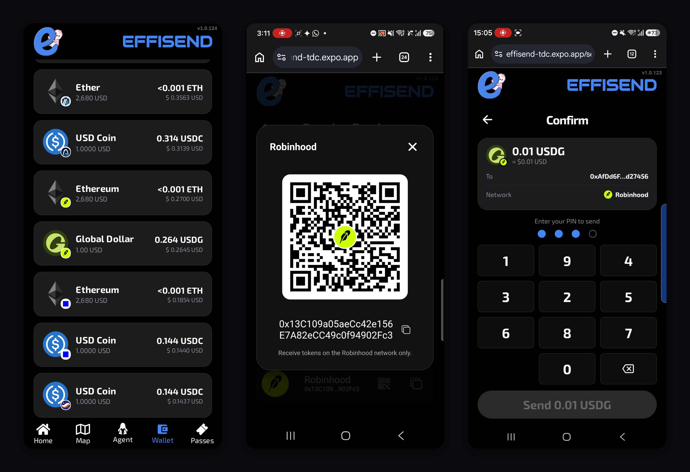
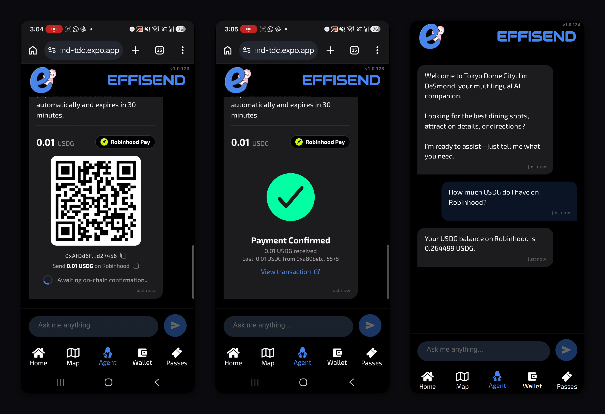
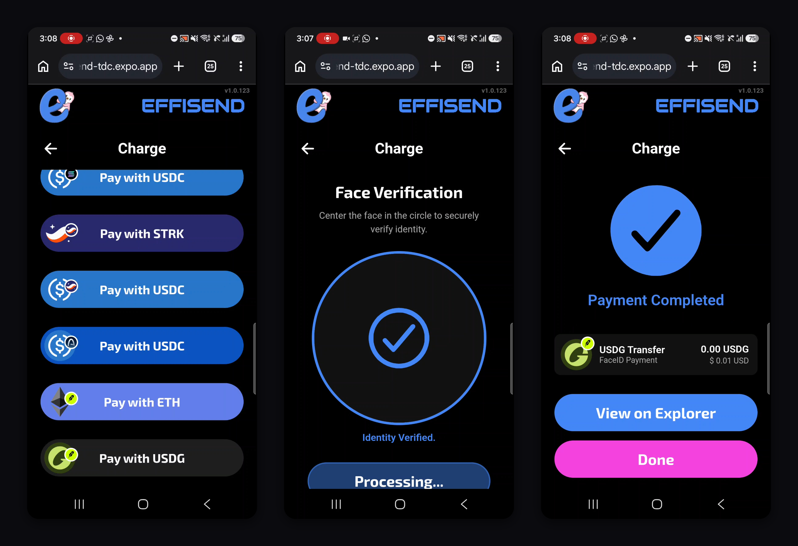
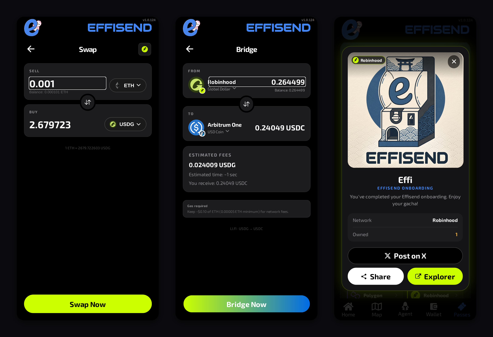
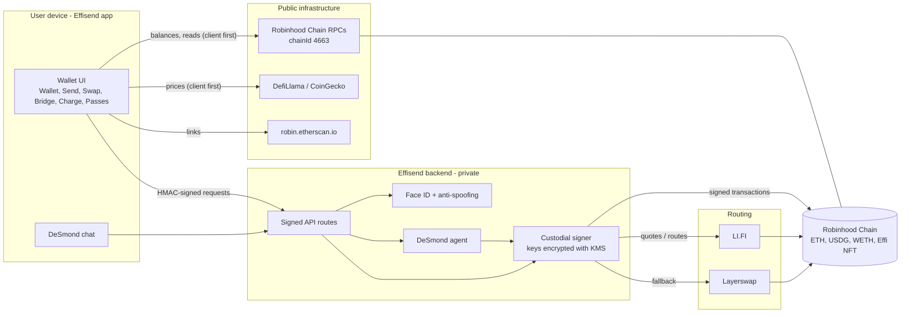
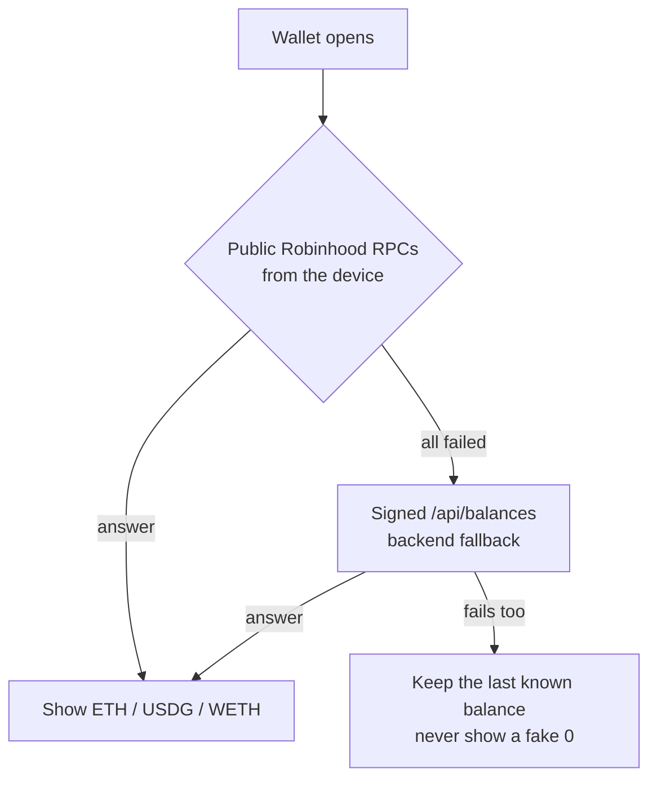
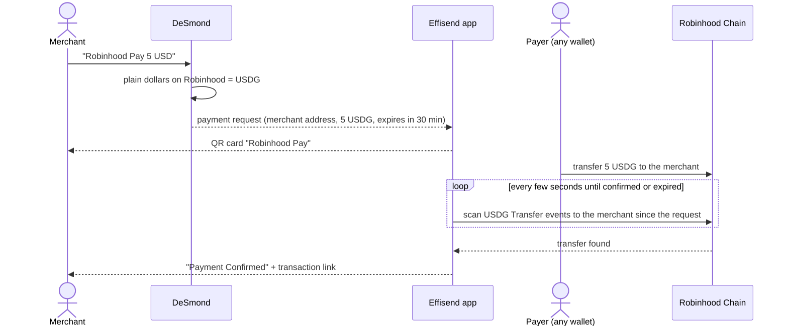
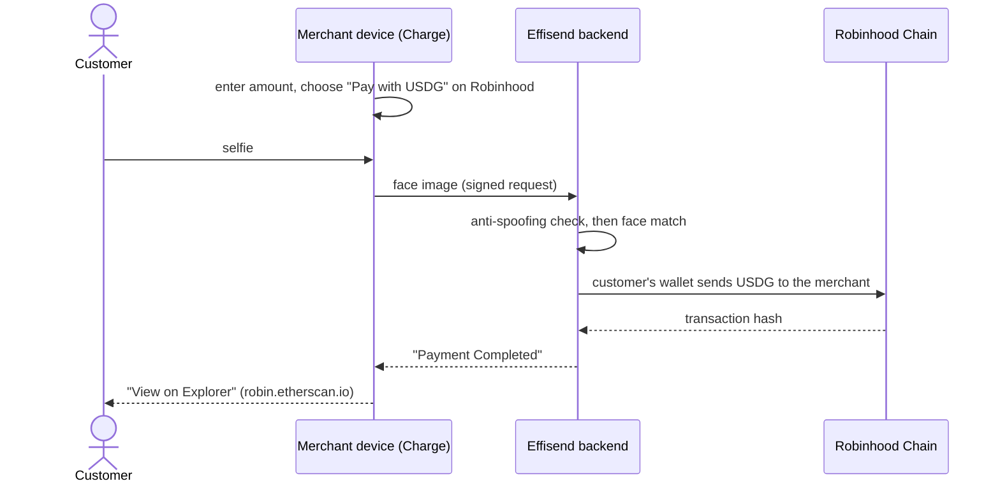
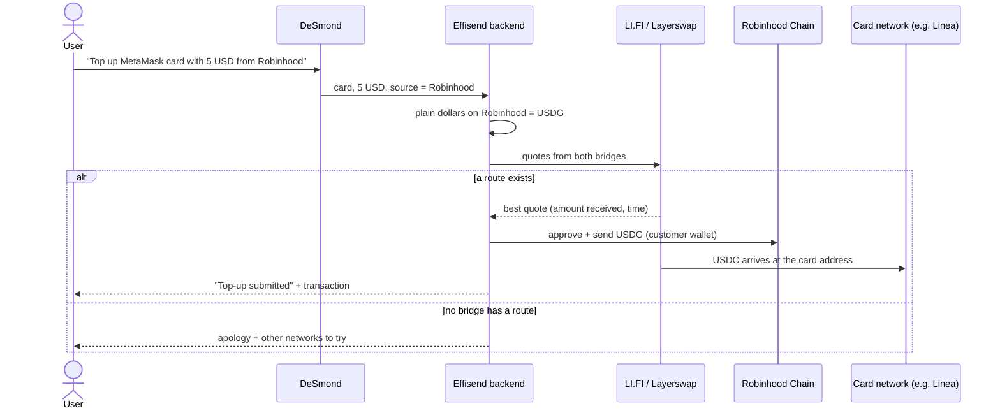
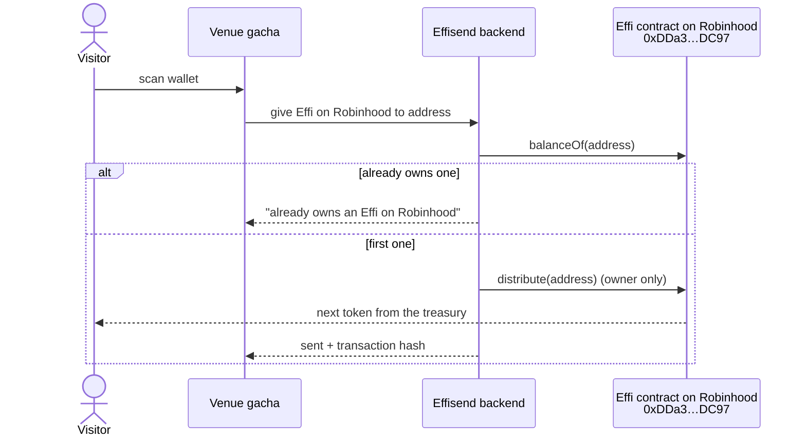

# Effisend on Robinhood Chain

**Effisend** is a multichain wallet you unlock with your face. It was built for visitors of Tokyo Dome City and comes with **DeSmond**, a multilingual AI concierge that also runs your wallet. **Robinhood Chain is one of its core networks**: USDG on Robinhood is the dollar behind Robinhood Pay, Face ID checkout, card top-ups and bridges, and the Effi collectible lives there too.

**Live app:** https://effisend-tdc.expo.app

This repository is the public, minimal companion for the Robinhood Chain hackathon. It contains:

- `Contracts/`: the Effi NFT contract, exactly as deployed (source, build and tests).
- `App/`: screenshots and the public Robinhood Chain configuration the app uses.
- This guide: what you can do on Robinhood Chain with Effisend, which services it connects to, and how it works.

The app's source code and its backend are not in this repository.

---

## Screens

| Wallet, Receive (QR) and Send on Robinhood |
|---|
|  |

| Robinhood Pay, created and confirmed through DeSmond |
|---|
|  |

| Face ID checkout paid in USDG on Robinhood |
|---|
|  |

| Swap, Bridge and the Effi NFT on Robinhood |
|---|
|  |

---

## Why Robinhood Chain is essential to Effisend

- **USDG is Effisend's dollar on Robinhood.** Robinhood Chain has no USDC, so whenever a user says "dollars" on Robinhood (a Robinhood Pay QR, a card top-up, a bridge), Effisend uses **USDG (Global Dollar)**. Users never have to choose a stablecoin.
- **Payments that confirm themselves.** Robinhood Pay requests and Face ID checkouts are settled on Robinhood Chain and detected automatically on-chain, with no manual "I paid" step.
- **A source of funds for the rest of the wallet.** USDG and ETH on Robinhood can be swapped, bridged to other networks, or used to top up a crypto card (for example the MetaMask Card on Linea).
- **The Effi collectible.** The Effi NFT is deployed on Robinhood Chain, and visitors can receive one there from the venue's gacha.
- **One address for every EVM network.** The same EVM address the user gets at sign-up works on Robinhood Chain from the first moment.

---

## What you can do on Robinhood Chain

| Feature | How to use it in Effisend | What happens on Robinhood Chain |
|---|---|---|
| **Create or recover a wallet** | Wallet tab, then *Start Process*, then take a selfie. | Your EVM address is ready on Robinhood immediately. |
| **See balances** | Wallet tab. | ETH, USDG and WETH are read straight from public Robinhood RPCs. |
| **Receive** | Wallet, then *Receive*, then *Robinhood* (QR icon). | A QR with your address, valid on Robinhood Chain only. |
| **Send** | Wallet, then *Send*: pick *USDG on Robinhood* (or ETH or WETH), the recipient, then your PIN. | An ERC-20 or native transfer signed by your custodial wallet. |
| **Swap** | Wallet, then *Swap*: choose *Robinhood*, then ETH ⇄ USDG. | The swap is routed through LI.FI. |
| **Bridge** | Wallet, then *Bridge*: from *Robinhood (USDG)* to another network. | USDG leaves Robinhood through LI.FI, with Layerswap as fallback. |
| **Robinhood Pay (receive a payment)** | Agent tab: *"Robinhood Pay 5 USD"*. | DeSmond creates a USDG payment QR and the card turns to *Payment Confirmed* when the transfer arrives. |
| **Face ID checkout (merchant)** | Charge: enter the amount, then *Pay with USDG* (or *Pay with ETH*) on Robinhood, then the customer's face. | The customer's wallet pays the merchant in USDG or ETH. |
| **Top up a crypto card** | Agent tab: *"Top up MetaMask card with 5 USD from Robinhood"*. | USDG on Robinhood is bridged to the card's own token and network (for example USDC on Linea). |
| **Collect the Effi NFT** | Scan the venue's gacha. It then appears in the Passes tab under *Effi*, as *Robinhood*. | `distribute(to)` on the Effi contract hands you the next token. One per wallet per network. |
| **Ask DeSmond** | *"How much USDG do I have on Robinhood?"* | A live, read-only balance query. |
| **Analytics** | `/analytics` | On-chain inflow to the venue's point-of-sale wallets, Robinhood included. |

Tips:

- Keep a little **ETH on Robinhood** for gas (≥ 0.0001 ETH is a comfortable floor).
- Amounts in plain dollars ("5 USD", "5 dólares") always mean **USDG** on Robinhood.
- Bridges and top-ups have fixed fees of a few cents, so very small amounts (under ~1 USD) lose a noticeable share.

---

## Connected services

| Service | Used for | Where it runs |
|---|---|---|
| **Robinhood Chain public RPCs** (globalstake, publicnode, ordofi, official, Pocket) | Balances, contract reads, transaction broadcast | Reads run on the device first; the backend is the fallback. Transactions are broadcast by the backend. |
| **Robinhood Chain explorer** (robin.etherscan.io) | Transaction and address links | Device |
| **USDG (Global Dollar)** `0x5fc5…d168` | The dollar for Pay, checkout, top-ups and bridges | On-chain token |
| **LI.FI** (routes through bridges such as Across and Relay) | Swaps, bridges and card top-ups from Robinhood | Backend |
| **Layerswap** | Bridge fallback for Robinhood routes | Backend |
| **DefiLlama and CoinGecko** | USD prices for ETH, USDG and WETH | Device first; the backend is the last resort |
| **Effisend RPC registry** | Health-checks public RPCs and ranks them for the app | Backend, refreshed every 15 min |
| **AWS serverless backend** | Key custody (keys encrypted with KMS), face verification with anti-spoofing, DeSmond (LLM agent) | Backend |
| **Expo / EAS Hosting** | Serves the web app and its signed API routes | Edge |

The rule throughout is **client first, server as fallback**. Reads (balances, prices, NFTs) go straight from the user's device to public infrastructure. The backend steps in only when those fail, and it is always the one that signs transactions.

---

## How it works

### Architecture



### Reading balances: client first, server as fallback



### Robinhood Pay



### Face ID checkout in USDG



### Card top-up and bridges out of Robinhood



### Effi NFT on Robinhood



---

## Contracts

`Contracts/contracts/EffisendNFT.sol` is an ERC-721 built on OpenZeppelin 5. Every token shares one metadata URI, and token ids start at 0.

- `mintBatch(quantity)` mints to the owner's treasury. `distribute(to)` then hands out the next token still held by the treasury, in id order, with no off-chain bookkeeping.
- `mint(to)` mints straight to a recipient.
- `setURI(uri)` updates the shared metadata.

| Network | Address | Explorer |
|---|---|---|
| **Robinhood Chain** (4663) | `0xDDa30795FF04677C1c4B58616b7b77503554DC97` | [robin.etherscan.io](https://robin.etherscan.io/address/0xDDa30795FF04677C1c4B58616b7b77503554DC97) |
| Arbitrum One (42161) | `0xDDa30795FF04677C1c4B58616b7b77503554DC97` | [arbiscan.io](https://arbiscan.io/address/0xDDa30795FF04677C1c4B58616b7b77503554DC97) |
| Arc, Base, Polygon, Avalanche, Monad | same address | see [`Contracts/deployments.json`](Contracts/deployments.json) |

The runtime bytecode on Robinhood Chain matches this source **byte for byte** when compiled with solc 0.8.28, the optimizer at 200 runs and `evmVersion: cancun`.

```bash
cd Contracts
npm ci
EVM=cancun node compile.cjs   # writes build/EffisendNFT.json (ABI + bytecode)
node test.cjs                 # local Hardhat network: mint, distribute, permissions
```

---

## Security model

- **Custodial by design.** Private keys never reach the device. They are encrypted with AWS KMS and decrypted only by the backend functions that sign. The app keeps only a session identifier.
- **Face ID with anti-spoofing.** A liveness check runs before every face match. Photos of a screen or printed faces are rejected.
- **PIN** to confirm sends from the wallet.
- **Signed API.** Every request from the app is HMAC-signed.
- **Guarded card top-ups.** A top-up through DeSmond runs at most once per message, and only with the source network and amount the user actually wrote. DeSmond never retries it on its own with other networks or amounts.

---

## Repository layout

```
Effisend-RH/
├── App/
│   ├── robinhood-chain.json   # public Robinhood Chain config used by the app
│   └── screenshots/           # UI captures from the live app
├── Contracts/
│   ├── contracts/EffisendNFT.sol
│   ├── compile.cjs  test.cjs  hardhat.config.cjs
│   ├── package.json  package-lock.json
│   └── deployments.json       # addresses on every chain
├── AGENTS.md                  # guide for AI agents working on this repo
├── LICENSE                    # MIT
└── README.md
```

## License

MIT. See [LICENSE](LICENSE).
