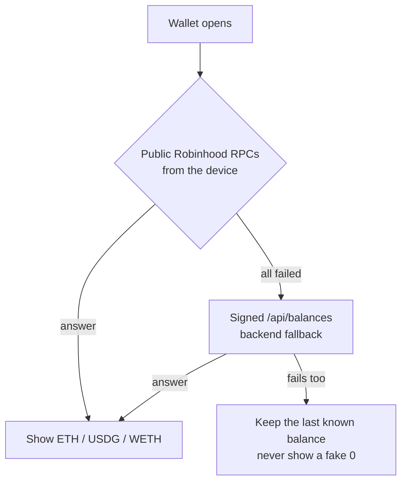
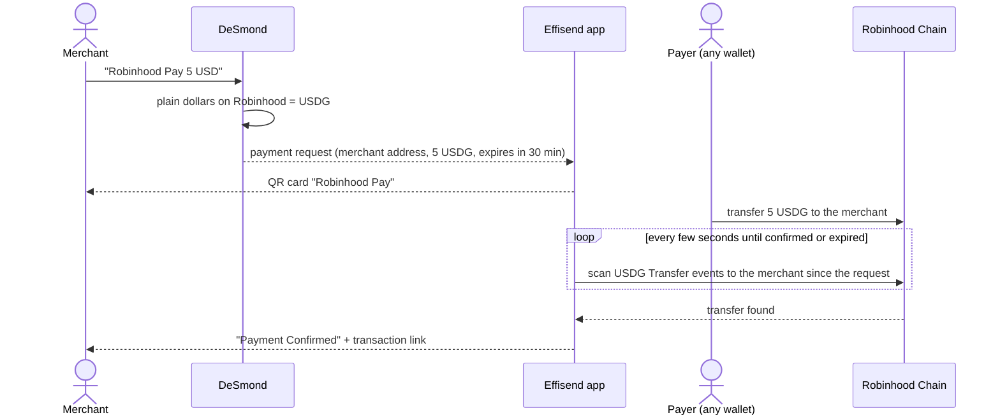
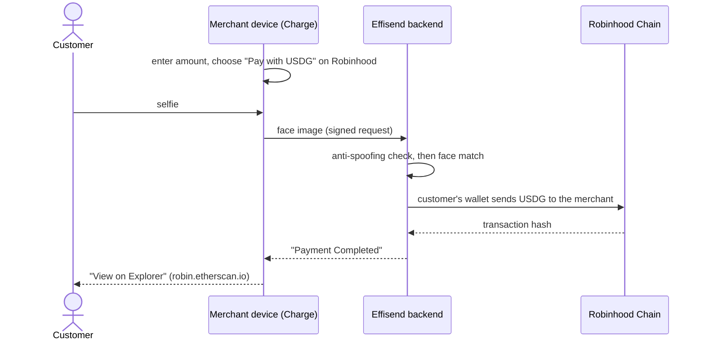
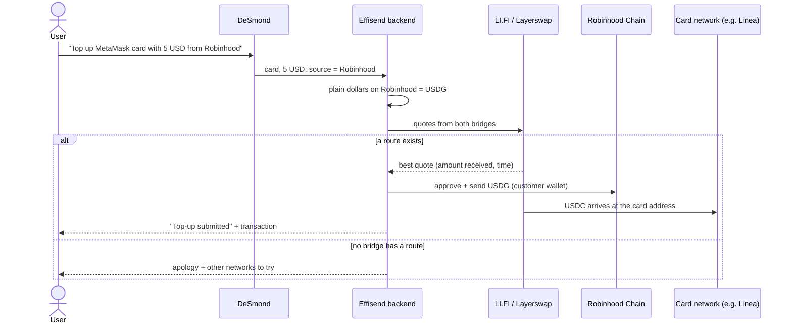
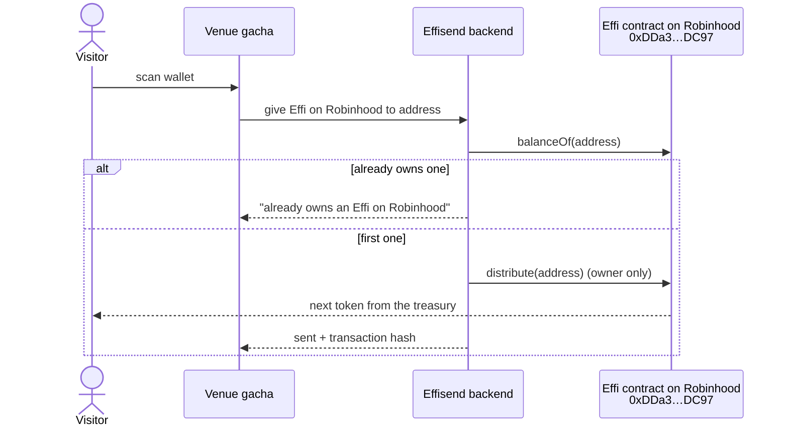
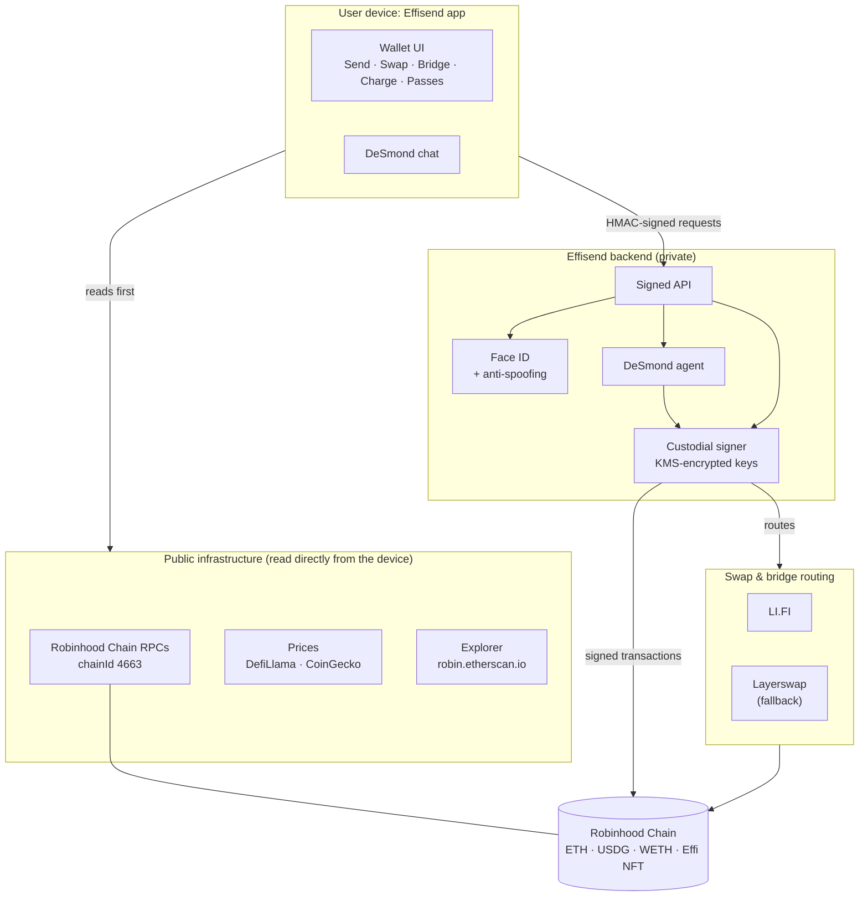

# Effisend on Robinhood Chain

**Effisend** is a multichain wallet you unlock with your face. It was built for visitors of Tokyo Dome City and comes with **DeSmond**, a multilingual AI concierge that also runs your wallet. **Robinhood Chain is one of its core networks**: USDG on Robinhood is the dollar behind Robinhood Pay, Face ID checkout, card top-ups and bridges, and the Effi collectible lives there too.

**Live app:** https://effisend-tdc.expo.app

This repository is the public, minimal companion for the Robinhood Chain hackathon:

- `Contracts/`: the Effi NFT contract, exactly as deployed (source, build and tests).
- `App/`: screenshots and the public Robinhood Chain configuration the app uses.
- This guide: what you can do on Robinhood Chain with Effisend, which services it connects to, and how it works.

The app's source code and its backend are not in this repository.

**Contents**

1. [Why Robinhood Chain is essential](#why-robinhood-chain-is-essential-to-effisend)
2. [Wallet: balances, receive and send](#1-wallet-balances-receive-and-send)
3. [Robinhood Pay](#2-robinhood-pay)
4. [Face ID checkout in USDG](#3-face-id-checkout-in-usdg)
5. [Swap, bridge and card top-ups](#4-swap-bridge-and-card-top-ups)
6. [The Effi NFT on Robinhood](#5-the-effi-nft-on-robinhood)
7. [DeSmond and analytics](#6-desmond-and-analytics)
8. [Quick reference](#quick-reference)
9. [Architecture and connected services](#architecture-and-connected-services)
10. [Contracts](#contracts)
11. [Security model](#security-model)

---

## Why Robinhood Chain is essential to Effisend

- **USDG is Effisend's dollar on Robinhood.** Robinhood Chain has no USDC, so whenever a user says "dollars" on Robinhood (a Robinhood Pay QR, a card top-up, a bridge), Effisend uses **USDG (Global Dollar)**. Users never have to choose a stablecoin.
- **Payments that confirm themselves.** Robinhood Pay requests and Face ID checkouts are settled on Robinhood Chain and detected automatically on-chain, with no manual "I paid" step.
- **A source of funds for the rest of the wallet.** USDG and ETH on Robinhood can be swapped, bridged to other networks, or used to top up a crypto card (for example the MetaMask Card on Linea).
- **The Effi collectible.** The Effi NFT is deployed on Robinhood Chain, and visitors can receive one there from the venue's gacha.
- **One address for every EVM network.** The same EVM address the user gets at sign-up works on Robinhood Chain from the first moment.

Every transaction linked below was made through the live app, with Effisend's own test wallet (`0xa80B…5578`) and the venue's point-of-sale wallet (`0xAfDd…7456`).

---

## 1. Wallet: balances, receive and send


**How to use it**

- **Create or recover a wallet:** go to the Wallet tab, tap *Start Process* and take a selfie. Your EVM address is ready on Robinhood Chain immediately.
- **Balances:** the Wallet tab lists **ETH, USDG (Global Dollar) and WETH** on Robinhood, next to every other network.
- **Receive:** Wallet, then *Receive*, then the QR icon on *Robinhood*. The QR is valid on Robinhood Chain only.
- **Send:** Wallet, then *Send*. Pick *USDG on Robinhood* (or ETH or WETH), enter the recipient, then confirm with your PIN.

**How balances are read: client first, server as fallback**



> Keep a little **ETH on Robinhood** for gas. 0.0001 ETH or more is a comfortable floor.

---

## 2. Robinhood Pay


**How to use it**

1. In the Agent tab, tell DeSmond *"Robinhood Pay 5 USD"*. Plain dollars on Robinhood always mean **USDG**.
2. DeSmond replies with a **Robinhood Pay** card: a QR with the merchant address and the exact amount, valid for 30 minutes.
3. The payer scans it with any wallet and sends USDG on Robinhood Chain.
4. The card switches to **Payment Confirmed** by itself, with a link to the transaction.



**On-chain proof:** [`0x9461…607a`](https://robin.etherscan.io/tx/0x94611b2590778ac952ef9b365e2aa0c82d4532b51d14ce55776b71e56dea607a). 0.01 USDG paid to the point of sale; the Robinhood Pay card detected it and switched to *Payment Confirmed* (2026-10-02).

---

## 3. Face ID checkout in USDG


**How to use it (merchant)**

1. Open *Charge* and enter the amount in USD.
2. Pick **Pay with USDG** (or **Pay with ETH**) on Robinhood.
3. The customer looks at the camera. An anti-spoofing check runs first, then the face match.
4. The customer's wallet pays the merchant on Robinhood Chain. The screen shows **Payment Completed** and a link to the explorer.



**On-chain proof:** [`0x06c2…b604`](https://robin.etherscan.io/tx/0x06c2a265a34f4df6c743208f2829e58ffa89b69a96d53de529689ee4fba8b604). 0.009999 USDG (≈ $0.01) from the customer to the point of sale, signed after a face match (2026-10-02).

---

## 4. Swap, bridge and card top-ups


**How to use it**

- **Swap:** Wallet, then *Swap*. Choose *Robinhood*, then ETH ⇄ USDG. The swap is routed through **LI.FI**.
- **Bridge:** Wallet, then *Bridge*, from *Robinhood (USDG)* to another network. Robinhood Chain is not on Circle CCTP, so USDG leaves it through **LI.FI**, with **Layerswap** as fallback. The screen shows the fee, the time and what arrives.
- **Top up a crypto card:** in the Agent tab, tell DeSmond *"Top up MetaMask card with 5 USD from Robinhood"*. USDG on Robinhood is bridged to the card's own token and network (for example USDC on Linea for the MetaMask Card).



**On-chain proof (card top-up):**

- From Robinhood: [`0xc9bd…8a75`](https://robin.etherscan.io/tx/0xc9bdb0d58abc5e118317dd58ce53aacd40db4b8e5c362f8b481e78e51baf8a75). "0.1 USD from Robinhood Chain" resolved to USDG and sent into a LI.FI route (Relay), 2026-10-01.
- Arrival on Linea: [`0x3ca8…713e`](https://lineascan.build/tx/0x3ca8e0b83a2fc192741f64669fe91287031cf6b34de408cf91eb209cf234713e), about a second later.

> Bridges and top-ups carry fixed fees of a few cents. The top-up above was a deliberately tiny test, so the fee is a large share of it. From about 5 USD up, the fee drops below 1%.

---

## 5. The Effi NFT on Robinhood

<p align="center">
  
</p>

**How to use it**

- Scan your wallet at the venue's gacha. The Effi arrives on Robinhood Chain.
- It appears in the **Passes** tab under *Effi*. Tap *Robinhood* to see it: network, amount owned, *Share*, *Post on X* and *Explorer*.
- One Effi per wallet per network. A second scan is politely refused.



**On-chain proof:** [`0x470f…2d82`](https://robin.etherscan.io/tx/0x470f2546765b6f153ddd4eab91a92479aed53e8b3b2634b507cdb04a3daf2d82). Token #0 of the Effi collection sent from the treasury by `distribute()` (2026-09-30). The contract source is in [Contracts](#contracts).

---

## 6. DeSmond and analytics

- **Ask DeSmond** in any language, for example *"How much USDG do I have on Robinhood?"* (see the third screen in [Robinhood Pay](#2-robinhood-pay)). Balance questions are live, read-only on-chain queries.
- **Analytics** (`/analytics`): on-chain inflow to the venue's point-of-sale wallets per network, Robinhood Chain included, each linked to its explorer.

---

## Quick reference

| Feature | How to use it in Effisend | What happens on Robinhood Chain |
|---|---|---|
| **Create or recover a wallet** | Wallet tab, then *Start Process*, then a selfie. | Your EVM address is ready on Robinhood immediately. |
| **See balances** | Wallet tab. | ETH, USDG and WETH are read straight from public Robinhood RPCs. |
| **Receive** | Wallet, then *Receive*, then *Robinhood* (QR icon). | A QR with your address, valid on Robinhood Chain only. |
| **Send** | Wallet, then *Send*: *USDG on Robinhood* (or ETH or WETH), the recipient, then your PIN. | An ERC-20 or native transfer signed by your custodial wallet. |
| **Swap** | Wallet, then *Swap*: *Robinhood*, then ETH ⇄ USDG. | The swap is routed through LI.FI. |
| **Bridge** | Wallet, then *Bridge*: from *Robinhood (USDG)*. | USDG leaves through LI.FI, with Layerswap as fallback. |
| **Robinhood Pay** | Agent tab: *"Robinhood Pay 5 USD"*. | A USDG payment QR that confirms itself on-chain. |
| **Face ID checkout** | Charge: amount, then *Pay with USDG* or *Pay with ETH*, then the customer's face. | The customer's wallet pays the merchant. |
| **Card top-up** | Agent tab: *"Top up MetaMask card with 5 USD from Robinhood"*. | USDG is bridged to the card's token and network. |
| **Effi NFT** | Venue gacha, then the Passes tab. | `distribute(to)` on the Effi contract. |
| **Ask DeSmond** | *"How much USDG do I have on Robinhood?"* | A live, read-only balance query. |
| **Analytics** | `/analytics` | Point-of-sale inflow per network, Robinhood included. |

Amounts in plain dollars ("5 USD", "5 dollars") always mean **USDG** on Robinhood.

---

## Architecture and connected services



| Service | Used for | Where it runs |
|---|---|---|
| **Robinhood Chain public RPCs** (globalstake, publicnode, ordofi, official, Pocket) | Balances, contract reads, transaction broadcast | Reads run on the device first; the backend is the fallback. Transactions are broadcast by the backend. |
| **Robinhood Chain explorer** (robin.etherscan.io) | Transaction and address links | Device |
| **USDG (Global Dollar)** `0x5fc5…d168` | The dollar for Pay, checkout, top-ups and bridges | On-chain token |
| **LI.FI** (routes through bridges such as Across and Relay) | Swaps, bridges and card top-ups from Robinhood | Backend |
| **Layerswap** | Bridge fallback for Robinhood routes | Backend |
| **DefiLlama and CoinGecko** | USD prices for ETH, USDG and WETH | Device first; the backend is the last resort |
| **Effisend RPC registry** | Health-checks public RPCs and ranks them for the app | Backend, refreshed every 15 min |
| **AWS serverless backend** | Key custody (keys encrypted with KMS), face verification with anti-spoofing, DeSmond (LLM agent) | Backend |
| **Expo / EAS Hosting** | Serves the web app and its signed API routes | Edge |

The rule throughout is **client first, server as fallback**. Reads (balances, prices, NFTs) go straight from the user's device to public infrastructure. The backend steps in only when those fail, and it is always the one that signs transactions.

---

## Contracts

`Contracts/contracts/EffisendNFT.sol` is an ERC-721 built on OpenZeppelin 5. Every token shares one metadata URI, and token ids start at 0.

- `mintBatch(quantity)` mints to the owner's treasury. `distribute(to)` then hands out the next token still held by the treasury, in id order, with no off-chain bookkeeping.
- `mint(to)` mints straight to a recipient.
- `setURI(uri)` updates the shared metadata.

| Network | Address | Explorer |
|---|---|---|
| **Robinhood Chain** (4663) | `0xDDa30795FF04677C1c4B58616b7b77503554DC97` | [robin.etherscan.io](https://robin.etherscan.io/address/0xDDa30795FF04677C1c4B58616b7b77503554DC97) |
| Arbitrum One (42161) | `0xDDa30795FF04677C1c4B58616b7b77503554DC97` | [arbiscan.io](https://arbiscan.io/address/0xDDa30795FF04677C1c4B58616b7b77503554DC97) |
| Arc, Base, Polygon, Avalanche, Monad | same address | see [`Contracts/deployments.json`](Contracts/deployments.json) |

The runtime bytecode on Robinhood Chain matches this source **byte for byte** when compiled with solc 0.8.28, the optimizer at 200 runs and `evmVersion: cancun`.

```bash
cd Contracts
npm ci
EVM=cancun node compile.cjs   # writes build/EffisendNFT.json (ABI + bytecode)
node test.cjs                 # local Hardhat network: mint, distribute, permissions
```

---

## Security model

- **Custodial by design.** Private keys never reach the device. They are encrypted with AWS KMS and decrypted only by the backend functions that sign. The app keeps only a session identifier.
- **Face ID with anti-spoofing.** A liveness check runs before every face match. Photos of a screen or printed faces are rejected.
- **PIN** to confirm sends from the wallet.
- **Signed API.** Every request from the app is HMAC-signed.
- **Guarded card top-ups.** A top-up through DeSmond runs at most once per message, and only with the source network and amount the user actually wrote. DeSmond never retries it on its own with other networks or amounts.

---

## Repository layout

```
Effisend-RH/
├── App/
│   ├── robinhood-chain.json   # public Robinhood Chain config used by the app
│   └── screenshots/           # UI captures from the live app (JPEG)
├── Contracts/
│   ├── contracts/EffisendNFT.sol
│   ├── compile.cjs  test.cjs  hardhat.config.cjs
│   ├── package.json  package-lock.json
│   └── deployments.json       # addresses on every chain
├── AGENTS.md                  # guide for AI agents working on this repo
├── LICENSE                    # MIT
└── README.md
```

## License

MIT. See [LICENSE](LICENSE).
