# Effisend — Face Checkout for Real-World Commerce on Robinhood Chain

> **Effisend turns a selfie + PIN into an on-chain checkout on Robinhood Chain: customers pay in USDG at the counter, with no card, no seed phrase and no app to install. It runs on a payment stack already proven in real merchant sales, the Pudgy Penguins Pop-Up at Tokyo Dome City.**

**Live app:** https://effisend-tdc.expo.app

Effisend is a multichain wallet you unlock with your face, built for visitors of Tokyo Dome City, with **DeSmond**, a multilingual AI concierge that also runs the wallet. On **Robinhood Chain**, **USDG** is the dollar behind Face ID checkout, Robinhood Pay, card top-ups and bridges, and the **Effi** collectible lives there too.

This repository is the public, minimal companion for the Robinhood Chain hackathon. It contains:

- `Contracts/`: the Effi NFT contract exactly as deployed, with its build script and tests.
- `Verifier/`: an independent, read-only checkout verifier with tests.
- `App/`: screenshots, photos and the public Robinhood Chain configuration the app uses.

The app's source code and its backend are not in this repository.

**Contents**

1. [At a glance](#at-a-glance)
2. [Built for Robinhood Chain](#built-for-robinhood-chain)
3. [Why Robinhood Chain is essential](#why-robinhood-chain-is-essential-to-effisend)
4. [Face ID checkout](#1-face-id-checkout-selfie--pin)
5. [Robinhood Pay](#2-robinhood-pay)
6. [Wallet: balances, receive and send](#3-wallet-balances-receive-and-send)
7. [Swap, bridge and card top-ups](#4-swap-bridge-and-card-top-ups)
8. [The Effi NFT on Robinhood](#5-the-effi-nft-on-robinhood)
9. [DeSmond and analytics](#6-desmond-and-analytics)
10. [Real-world traction: Pudgy Penguins Pop-Up](#real-world-traction-pudgy-penguins-pop-up)
11. [Verify any checkout yourself](#verify-any-checkout-yourself)
12. [Quick reference](#quick-reference)
13. [Architecture and connected services](#architecture-and-connected-services)
14. [Contracts](#contracts)
15. [Security model](#security-model)

---

## At a glance

| | Fact | Proof |
|---|---|---|
| **Face ID checkout on Robinhood** | Selfie, then PIN, then USDG paid on Robinhood Chain | [`0x06c2…b604`](https://robin.etherscan.io/tx/0x06c2a265a34f4df6c743208f2829e58ffa89b69a96d53de529689ee4fba8b604) |
| **Robinhood Pay** | USDG payment QR that confirms itself on-chain | [`0x9461…607a`](https://robin.etherscan.io/tx/0x94611b2590778ac952ef9b365e2aa0c82d4532b51d14ce55776b71e56dea607a) |
| **Card top-up from Robinhood** | USDG on Robinhood to USDC on Linea in about a second | [`0xc9bd…8a75`](https://robin.etherscan.io/tx/0xc9bdb0d58abc5e118317dd58ce53aacd40db4b8e5c362f8b481e78e51baf8a75) → [`0x3ca8…713e`](https://lineascan.build/tx/0x3ca8e0b83a2fc192741f64669fe91287031cf6b34de408cf91eb209cf234713e) |
| **Effi NFT on Robinhood** | Contract verified byte for byte against this repo's source | [`0xDDa3…DC97`](https://robin.etherscan.io/address/0xDDa30795FF04677C1c4B58616b7b77503554DC97) |
| **Real merchant sales** | Pudgy Penguins Pop-Up, Tokyo Dome City: **20 paid orders, $635.67, 14 paying wallets** | [all 20 transactions](#real-world-traction-pudgy-penguins-pop-up) |
| **Independent verification** | Duplicate orders, expired quotes, wrong payee or token, caps, refunds, failed settlement | [`Verifier/`](Verifier/) (13 tests) |

---

## Built for Robinhood Chain

Robinhood Chain is where Effisend's checkout feels instant, and where its dollar lives.

- **Confirmation in a blink.** Robinhood Chain produces a block about every **0.1 seconds** (measured: 36,000 blocks in 3,678 s). A Face ID checkout or a Robinhood Pay QR is settled and detected on-chain before the customer puts their phone away.
- **A native dollar, USDG.** Every amount said in plain dollars on Robinhood becomes USDG automatically: "5 USD" at the counter, in DeSmond or for a card top-up. Users never pick a stablecoin.
- **Gas that costs cents.** ETH on Robinhood covers fees. Effisend keeps a small floor so checkouts never stall.
- **EVM, so zero friction.** Every Effisend wallet works on Robinhood Chain from the moment it is created, with the same address as on every other EVM network.

**Everything Effisend does, it does on Robinhood Chain:** Face ID checkout, Robinhood Pay, wallet (balances, receive, send), swap, bridge, card top-ups, the Effi NFT, DeSmond (the AI agent) and on-chain analytics. Every Robinhood transaction linked in this README was made through the live production app, between Effisend's own wallet and the venue's point-of-sale wallet.

---

## Why Robinhood Chain is essential to Effisend

- **USDG is Effisend's dollar on Robinhood.** Robinhood Chain has no USDC, so whenever a user says "dollars" on Robinhood (a checkout, a Robinhood Pay QR, a card top-up, a bridge), Effisend uses **USDG (Global Dollar)**. Users never have to choose a stablecoin.
- **Payments that confirm themselves.** Face ID checkouts and Robinhood Pay requests are settled on Robinhood Chain and detected automatically on-chain, with no manual "I paid" step.
- **A source of funds for the rest of the wallet.** USDG and ETH on Robinhood can be swapped, bridged to other networks, or used to top up a crypto card (for example the MetaMask Card on Linea).
- **The Effi collectible.** The Effi NFT is deployed on Robinhood Chain, and visitors can receive one there from the venue's gacha.
- **One address for every EVM network.** The same EVM address the user gets at sign-up works on Robinhood Chain from the first moment.

---

## 1. Face ID checkout (selfie + PIN)

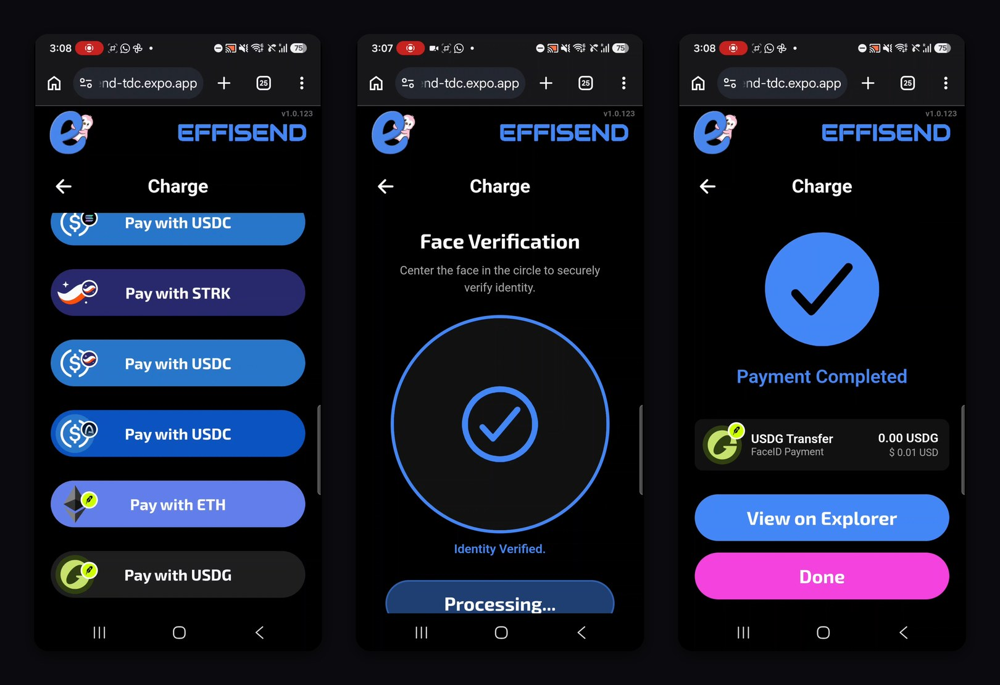

**How it works at the counter**

1. The merchant opens *Charge* and enters the amount in USD.
2. The customer looks at the camera. An **anti-spoofing** check runs first (photos of a screen or printed faces are rejected), then the face match finds their wallet.
3. The app lists what the customer can pay with. They pick **Pay with USDG** (or **Pay with ETH**) on Robinhood, or a stablecoin on another network such as **USDC on Arbitrum**.
4. If the customer set a **PIN**, they enter it to authorise the payment.
5. The customer's wallet pays the merchant on-chain. The screen shows **Payment Completed** and a link to the explorer.

No card, no seed phrase, no app download: the customer only needs their face and their PIN.

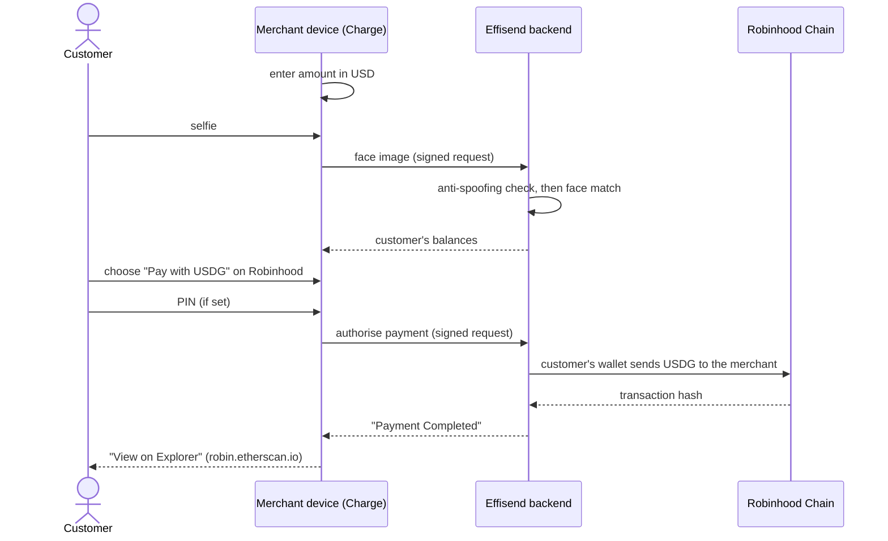

**On-chain proof:** [`0x06c2…b604`](https://robin.etherscan.io/tx/0x06c2a265a34f4df6c743208f2829e58ffa89b69a96d53de529689ee4fba8b604). 0.009999 USDG (≈ $0.01) from the customer to the point of sale (2026-10-02). Check it yourself with the [verifier](#verify-any-checkout-yourself).

---
## 2. Robinhood Pay

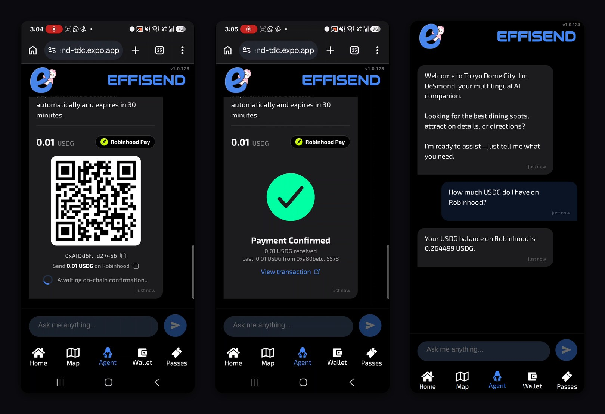

**How to use it**

1. In the Agent tab, tell DeSmond *"Robinhood Pay 5 USD"*. Plain dollars on Robinhood always mean **USDG**.
2. DeSmond replies with a **Robinhood Pay** card: a QR with the merchant address and the exact amount, valid for 30 minutes.
3. The payer scans it with any wallet and sends USDG on Robinhood Chain.
4. The card switches to **Payment Confirmed** by itself, with a link to the transaction.

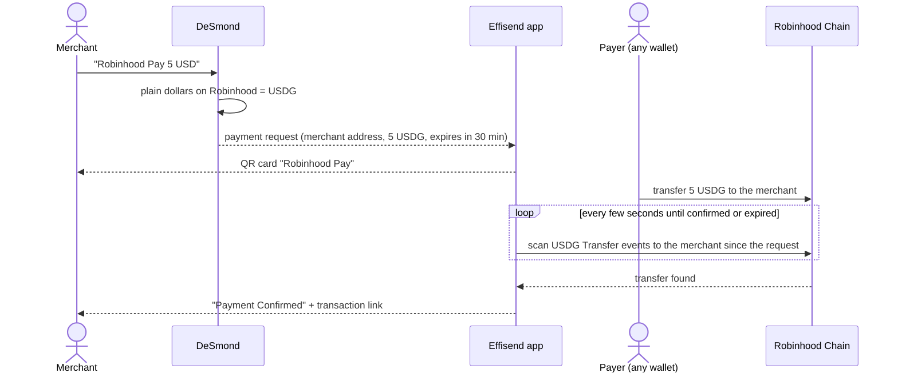

**On-chain proof:** [`0x9461…607a`](https://robin.etherscan.io/tx/0x94611b2590778ac952ef9b365e2aa0c82d4532b51d14ce55776b71e56dea607a). 0.01 USDG paid to the point of sale; the Robinhood Pay card detected it and switched to *Payment Confirmed* (2026-10-02).

---

## 3. Wallet: balances, receive and send

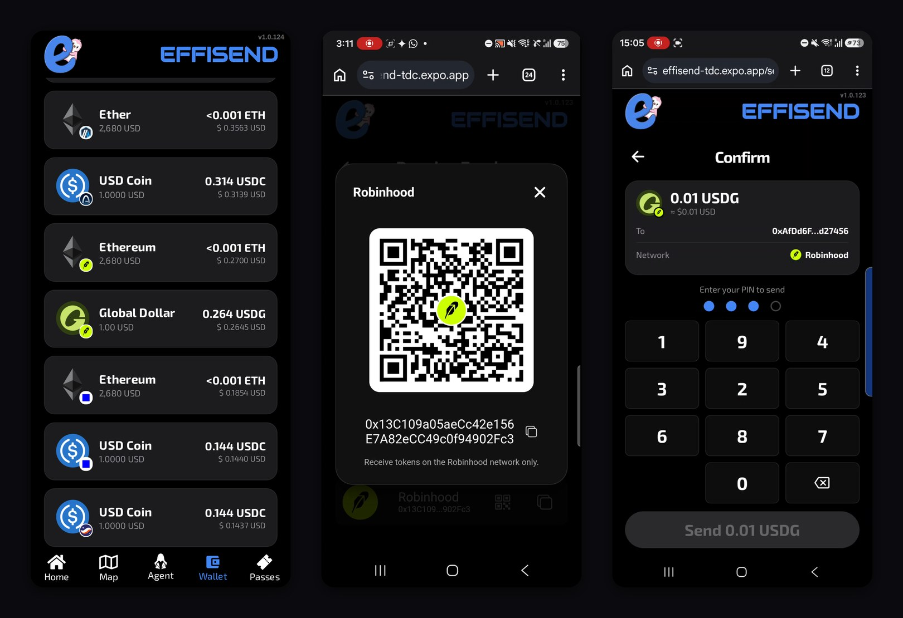

**How to use it**

- **Create or recover a wallet:** go to the Wallet tab, tap *Start Process* and take a selfie. Your EVM address is ready on Robinhood Chain immediately.
- **Balances:** the Wallet tab lists **ETH, USDG (Global Dollar) and WETH** on Robinhood, next to every other network.
- **Receive:** Wallet, then *Receive*, then the QR icon on *Robinhood*. The QR is valid on Robinhood Chain only.
- **Send:** Wallet, then *Send*. Pick *USDG on Robinhood* (or ETH or WETH), enter the recipient, then confirm with your PIN.

**How balances are read: client first, server as fallback**

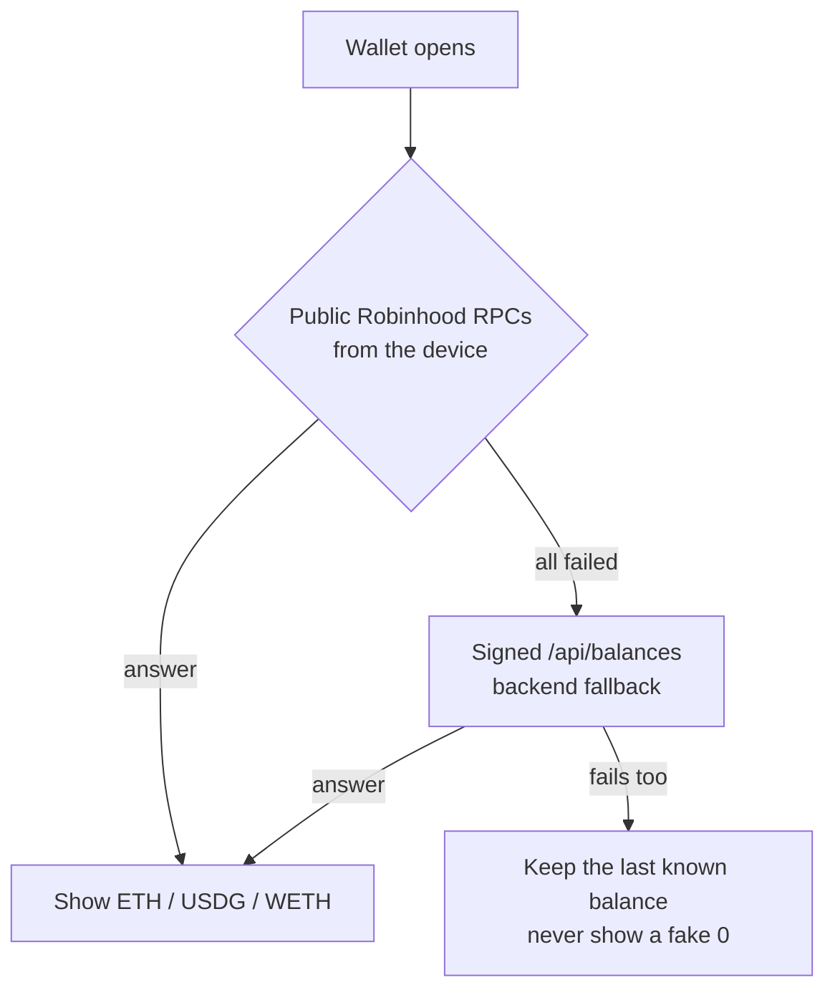

> Keep a little **ETH on Robinhood** for gas. 0.0001 ETH or more is a comfortable floor.

---

## 4. Swap, bridge and card top-ups

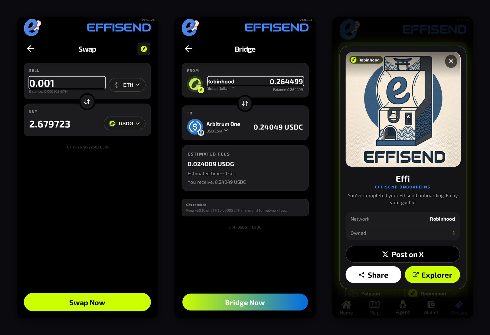

**How to use it**

- **Swap:** Wallet, then *Swap*. Choose *Robinhood*, then ETH ⇄ USDG. The swap is routed through **LI.FI**.
- **Bridge:** Wallet, then *Bridge*, from *Robinhood (USDG)* to another network. Robinhood Chain is not on Circle CCTP, so USDG leaves it through **LI.FI**, with **Layerswap** as fallback. The screen shows the fee, the time and what arrives.
- **Top up a crypto card:** in the Agent tab, tell DeSmond *"Top up MetaMask card with 5 USD from Robinhood"*. USDG on Robinhood is bridged to the card's own token and network (for example USDC on Linea for the MetaMask Card).

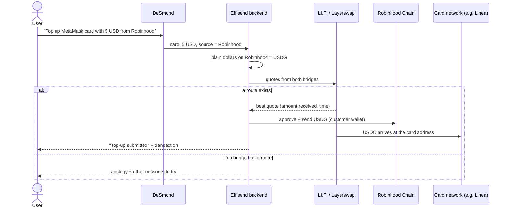

**On-chain proof (card top-up):**

- From Robinhood: [`0xc9bd…8a75`](https://robin.etherscan.io/tx/0xc9bdb0d58abc5e118317dd58ce53aacd40db4b8e5c362f8b481e78e51baf8a75). "0.1 USD from Robinhood Chain" resolved to USDG and sent into a LI.FI route (Relay), 2026-10-01.
- Arrival on Linea: [`0x3ca8…713e`](https://lineascan.build/tx/0x3ca8e0b83a2fc192741f64669fe91287031cf6b34de408cf91eb209cf234713e), about a second later.

> Bridges and top-ups carry fixed fees of a few cents. The top-up above was a deliberately tiny test, so the fee is a large share of it. From about 5 USD up, the fee drops below 1%.

---

## 5. The Effi NFT on Robinhood

<p align="center">
  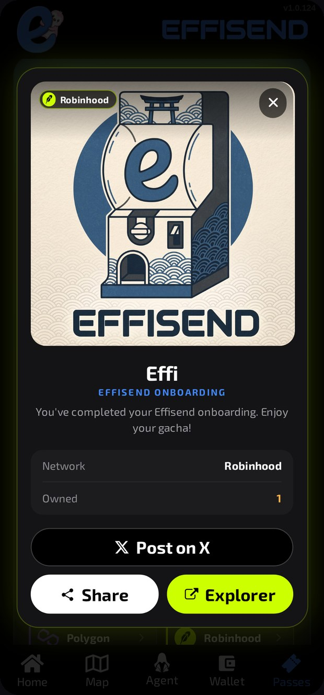
</p>

**How to use it**

- Scan your wallet at the venue's gacha. The Effi arrives on Robinhood Chain.
- It appears in the **Passes** tab under *Effi*. Tap *Robinhood* to see it: network, amount owned, *Share*, *Post on X* and *Explorer*.
- One Effi per wallet per network. A second scan is politely refused.

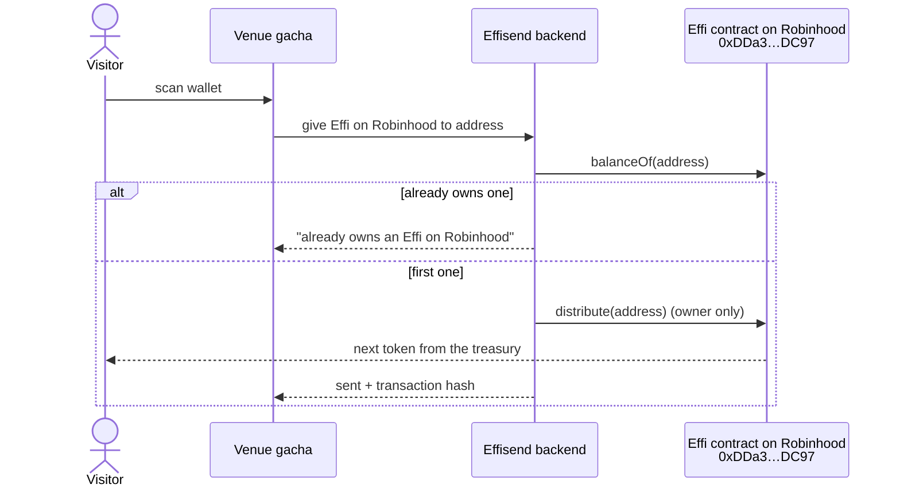

**On-chain proof:** [`0x470f…2d82`](https://robin.etherscan.io/tx/0x470f2546765b6f153ddd4eab91a92479aed53e8b3b2634b507cdb04a3daf2d82). Token #0 of the Effi collection sent from the treasury by `distribute()` (2026-09-30). The contract source is in [Contracts](#contracts).

---

## 6. DeSmond and analytics

- **Ask DeSmond** in any language, for example *"How much USDG do I have on Robinhood?"* (see the third screen in [Robinhood Pay](#2-robinhood-pay)). Balance questions are live, read-only on-chain queries.
- **Analytics** (`/analytics`): on-chain inflow to the venue's point-of-sale wallets per network, Robinhood Chain included, each linked to its explorer.

---

## Real-world traction: Pudgy Penguins Pop-Up

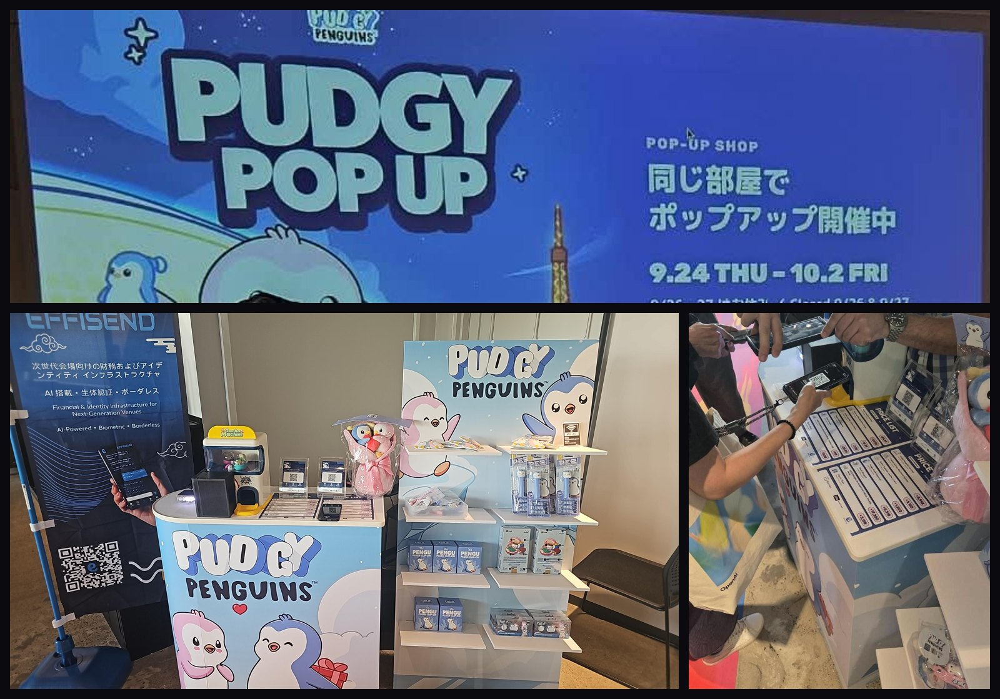

Effisend ran the checkout of a Pudgy Penguins merchandise pop-up shop at Tokyo Dome City. Customers paid in stablecoins to the shop's point-of-sale wallet, from their own wallets, with prices listed in USD and JPY.

Reconciled from the chains themselves. A payment counts when it reached the point-of-sale wallets in an official token contract, from a wallet that is not Effisend's own (not the point of sale, the test wallet or the NFT operators).

| Metric | Value |
|---|---|
| Paid orders | **20** |
| Gross merchandise value | **$635.67** (18 USDC, 2 USDT) |
| Distinct paying wallets | **14** (one wallet paid 7 orders, $289.98) |
| Average ticket | $31.78 |
| Failed on-chain payments | 0 |

| Network | Orders | Value | Share |
|---|---|---|---|
| Solana | 11 | $420.91 | 66.2% |
| Ethereum | 6 | $149.90 | 23.6% |
| Base | 3 | $64.86 | 10.2% |

Not counted: setup and test transfers under $5 (the morning of 9/24 and on 9/28) and internal movements.

<details>
<summary><b>All 20 orders, with links to the explorers</b></summary>

| # | Date (JST) | Network | Paid | Transaction |
|---|---|---|---|---|
| 1 | 2026-09-24 13:25 | Solana | 44.98 USDC | [`5SEcnB…JVXT`](https://solscan.io/tx/5SEcnBfBPEMWLU36qg6bpor5mJUN48PLrx4HdfZdBrfLo3J2coLyQbs54sZ2PMF4hgUfmq6ddLr873sjXRcCJVXT) |
| 2 | 2026-09-24 16:37 | Ethereum | 8.00 USDC | [`0x6860…a273`](https://etherscan.io/tx/0x68606c8223032e39fd803045068105b965c697bb0e4c764b383c9d7fd20ba273) |
| 3 | 2026-09-24 18:20 | Solana | 110.02 USDC | [`3EpHsg…jZUR`](https://solscan.io/tx/3EpHsgSG7XRRkSKrnExQQb1LA34WEDzWhZgfdBdZ1cpy3BYAnjMQMV6BkdRyMzZxics15JZtXoSEgXru4qnbjZUR) |
| 4 | 2026-09-24 19:00 | Base | 19.99 USDC | [`0x4af7…3c5b`](https://basescan.org/tx/0x4af7f70b8740b668d8c4a387170bbd1b50f80749131d2bf2f22a13bf07d13c5b) |
| 5 | 2026-09-24 19:01 | Solana | 27.99 USDC | [`3pnfVu…1nng`](https://solscan.io/tx/3pnfVu4K8vuMDzYeWYBgNKkgKHMZYNQanVPHiffjcvWX3WNBFygnDovDgvZLnujFfbcosCvmbiJw5UjavTmo1nng) |
| 6 | 2026-09-24 19:10 | Ethereum | 7.99 USDC | [`0x00e1…3dbd`](https://etherscan.io/tx/0x00e190883f64ff3e895b0574ac00d6a4106d7238ba765290c4b4a77d58133dbd) |
| 7 | 2026-09-24 19:50 | Solana | 19.99 USDC | [`4KS3pN…hoaY`](https://solscan.io/tx/4KS3pN3PmfczFWGvwvBccfv5LHWNDpmWwGE21SZnMRjPKhaVezaqYU2NnNFCRbpaeadDoenymv6WAxnJvU98hoaY) |
| 8 | 2026-09-24 19:59 | Solana | 19.99 USDC | [`2BgWSm…b4Bj`](https://solscan.io/tx/2BgWSmSRDSaURpXnXpRmAdhoddnMLXQeDUHxFDray9bWisJi9Tgb8BUbTEvLbUu24ufh3btDMJdSaxqp5nmKb4Bj) |
| 9 | 2026-09-24 20:01 | Solana | 49.98 USDC | [`5ssvit…X95N`](https://solscan.io/tx/5ssvitqpo7yGj36S8tyN71Nc2rANeEk859j1uxwMbBXdDwEaStCmUqwEvJMrS1rTpRbgvtSm54Pr2D6DZXAKX95N) |
| 10 | 2026-09-24 20:06 | Ethereum | 8.00 USDT | [`0x7ebb…995b`](https://etherscan.io/tx/0x7ebb8b16f2f637025337ae9761d64a44bda2bf2ea7a5cf20d22ba9c04f56995b) |
| 11 | 2026-09-24 20:36 | Solana | 19.99 USDC | [`2WRL3e…Rrwi`](https://solscan.io/tx/2WRL3ecYGwh1gCF5GRE1ZPZgpxD4H2KD5SGJRNbZnQArFMJjsuKtCUG3Mzp7iE46ayYy4zFEWwgVWD8CiRHhRrwi) |
| 12 | 2026-09-24 20:52 | Solana | 19.99 USDC | [`2aeds2…yEEv`](https://solscan.io/tx/2aeds2jnZwgr8PdC1yppUfiqU2BHFtR4StLU9KxbjUCuE8nprLsoVeht3LvdoWhAhcFNDrXNPHzQ4XwP1Rc8yEEv) |
| 13 | 2026-09-24 20:57 | Solana | 49.99 USDC | [`2j1w3u…m463`](https://solscan.io/tx/2j1w3uSDaiw4BCcT9sJqHLoUmRPXkYhDrMhT2WY9XGUKnhGL4kW8NE32GVMR57JCrZXr3wfwQBVGWtVFpNgQm463) |
| 14 | 2026-09-24 21:01 | Base | 19.88 USDC | [`0x00c6…672c`](https://basescan.org/tx/0x00c6ae336b624aca369aebebaca5b2e7ccd6c1e757c994afd2e3901c349a672c) |
| 15 | 2026-09-24 21:32 | Solana | 49.99 USDC | [`P2oSqV…tGEw`](https://solscan.io/tx/P2oSqVLHAGJ8uGznrwiK2ojJg4TEPu45ZwdRiTCLoCLNtxyFgCAquFdDHdH63UWD4H9H6F6tseiAYGcFwiCtGEw) |
| 16 | 2026-09-25 10:53 | Ethereum | 80.92 USDT | [`0xa631…8dd9`](https://etherscan.io/tx/0xa631a9e74bf970707ef0f56e867529172c6f4e6f143ed8648953e70b0d728dd9) |
| 17 | 2026-09-25 12:57 | Base | 24.99 USDC | [`0xb232…9ce7`](https://basescan.org/tx/0xb23272758b029f8564325247569d93fcc4eb7ce2d9309a758eba51b48a0a9ce7) |
| 18 | 2026-09-25 14:08 | Ethereum | 19.99 USDC | [`0x4bfe…3e05`](https://etherscan.io/tx/0x4bfe317fd547bc24883983b6a069038b1f9ddd46b93f986c6061a349e9d53e05) |
| 19 | 2026-09-25 18:25 | Solana | 7.99 USDC | [`meVte6…8kmi`](https://solscan.io/tx/meVte6ZPpAVW9oub6BVpTnF8cpKo4GR55hBNbcv1Wm76qcF2TzQ6aLCvZm3orXBBnaTZVVvCVZhxMssrmvK8kmi) |
| 20 | 2026-10-01 15:05 | Ethereum | 24.99 USDC | [`0xa96b…d571`](https://etherscan.io/tx/0xa96b95e3991d83de10392352bdbbabfe6f90b58c5e09439bad0a93635418d571) |

</details>

**Next stop: Robinhood Chain.** The same counter flow, now with Face ID and USDG on Robinhood Chain's ~0.1 s blocks, is live in the app today (see [Face ID checkout](#1-face-id-checkout-selfie--pin)). The pop-up showed that real customers will pay in stablecoins at a merch counter; Robinhood Chain makes that payment confirm instantly in a native dollar.

**Next: live Face Checkout demos on Robinhood Chain at TOKEN2049 Singapore.**

---

## Verify any checkout yourself

[`Verifier/`](Verifier/) is a small, dependency-free tool that answers one question from the chain alone: **did this exact order get paid, once, on time, to the right wallet, in the right token?** It needs no keys and no backend, and runs on public RPCs for Robinhood Chain (USDG, WETH) and Arbitrum One (USDC).

```bash
cd Verifier
node --test                 # 12 offline tests on two real Robinhood receipts
LIVE=1 node --test          # + 1 test that re-reads both receipts from Robinhood Chain

node verify.mjs --chain 4663 --token USDG --amount 0.009999 \
  --payee 0xAfDd6F1608F20481aD8376AB36B5080B2Ad27456 \
  --tx 0x06c2a265a34f4df6c743208f2829e58ffa89b69a96d53de529689ee4fba8b604 \
  --created 2026-10-02T06:07:00Z
# PASS settled · token · payee · amount · window · unique  ->  ✔ order settled
```

| Risk | Check | Covered by test |
|---|---|---|
| Failed settlement | the transaction must succeed | reverted transaction never settles |
| Wrong payee | the token must reach the merchant's wallet | funds sent to another wallet |
| Wrong token | the right token contract (spam copies don't match) | WETH order paid in USDG |
| Underpayment | paid ≥ order amount (tolerance is explicit) | 0.01 order paid 0.009999 |
| Caps | paid ≤ the merchant's limit | payment above the cap |
| Expired quote | paid inside the request's time window | paid after 30 min; paid before the order |
| Duplicate order | one transaction settles one order only | same hash reused |
| Refund | same token back from the merchant to the original payer, at most what was paid | valid, too large, wrong recipient |

The verifier is a public reference for these checks, so anyone (judges, merchants, auditors) can confirm a payment independently. It is not the code of Effisend's private backend.

---
## Quick reference

| Feature | How to use it in Effisend | What happens on Robinhood Chain |
|---|---|---|
| **Create or recover a wallet** | Wallet tab, then *Start Process*, then a selfie. | Your EVM address is ready on Robinhood immediately. |
| **See balances** | Wallet tab. | ETH, USDG and WETH are read straight from public Robinhood RPCs. |
| **Receive** | Wallet, then *Receive*, then *Robinhood* (QR icon). | A QR with your address, valid on Robinhood Chain only. |
| **Send** | Wallet, then *Send*: *USDG on Robinhood* (or ETH or WETH), the recipient, then your PIN. | An ERC-20 or native transfer signed by your custodial wallet. |
| **Swap** | Wallet, then *Swap*: *Robinhood*, then ETH ⇄ USDG. | The swap is routed through LI.FI. |
| **Bridge** | Wallet, then *Bridge*: from *Robinhood (USDG)*. | USDG leaves through LI.FI, with Layerswap as fallback. |
| **Robinhood Pay** | Agent tab: *"Robinhood Pay 5 USD"*. | A USDG payment QR that confirms itself on-chain. |
| **Face ID checkout** | Charge: amount, the customer's selfie, *Pay with USDG* (or ETH), then their PIN. | The customer's wallet pays the merchant. |
| **Card top-up** | Agent tab: *"Top up MetaMask card with 5 USD from Robinhood"*. | USDG is bridged to the card's token and network. |
| **Effi NFT** | Venue gacha, then the Passes tab. | `distribute(to)` on the Effi contract. |
| **Ask DeSmond** | *"How much USDG do I have on Robinhood?"* | A live, read-only balance query. |
| **Analytics** | `/analytics` | Point-of-sale inflow per network, Robinhood included. |

Amounts in plain dollars ("5 USD", "5 dollars") always mean **USDG** on Robinhood.

---

## Architecture and connected services

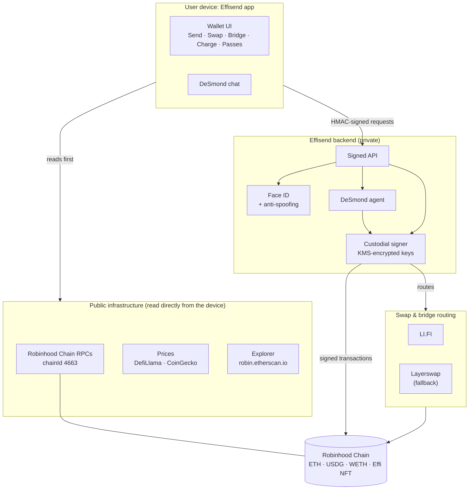

| Service | Used for | Where it runs |
|---|---|---|
| **Robinhood Chain public RPCs** (globalstake, publicnode, ordofi, official, Pocket) | Balances, contract reads, transaction broadcast | Reads run on the device first; the backend is the fallback. Transactions are broadcast by the backend. |
| **Robinhood Chain explorer** (robin.etherscan.io) | Transaction and address links | Device |
| **USDG (Global Dollar)** `0x5fc5…d168` | The dollar for Pay, checkout, top-ups and bridges | On-chain token |
| **LI.FI** (routes through bridges such as Across and Relay) | Swaps, bridges and card top-ups from Robinhood | Backend |
| **Layerswap** | Bridge fallback for Robinhood routes | Backend |
| **DefiLlama and CoinGecko** | USD prices for ETH, USDG and WETH | Device first; the backend is the last resort |
| **Effisend RPC registry** | Health-checks public RPCs and ranks them for the app | Backend, refreshed every 15 min |
| **AWS serverless backend** | Key custody (keys encrypted with KMS), face verification with anti-spoofing, DeSmond (LLM agent) | Backend |
| **Expo / EAS Hosting** | Serves the web app and its signed API routes | Edge |

The rule throughout is **client first, server as fallback**. Reads (balances, prices, NFTs) go straight from the user's device to public infrastructure. The backend steps in only when those fail, and it is always the one that signs transactions.

---

## Contracts

`Contracts/contracts/EffisendNFT.sol` is an ERC-721 built on OpenZeppelin 5. Every token shares one metadata URI, and token ids start at 0.

- `mintBatch(quantity)` mints to the owner's treasury. `distribute(to)` then hands out the next token still held by the treasury, in id order, with no off-chain bookkeeping.
- `mint(to)` mints straight to a recipient.
- `setURI(uri)` updates the shared metadata.

| Network | Address | Explorer |
|---|---|---|
| **Robinhood Chain** (4663) | `0xDDa30795FF04677C1c4B58616b7b77503554DC97` | [robin.etherscan.io](https://robin.etherscan.io/address/0xDDa30795FF04677C1c4B58616b7b77503554DC97) |
| Arbitrum One (42161) | `0xDDa30795FF04677C1c4B58616b7b77503554DC97` | [arbiscan.io](https://arbiscan.io/address/0xDDa30795FF04677C1c4B58616b7b77503554DC97) |
| Arc, Base, Polygon, Avalanche, Monad | same address | see [`Contracts/deployments.json`](Contracts/deployments.json) |

The runtime bytecode on Robinhood Chain matches this source **byte for byte** when compiled with solc 0.8.28, the optimizer at 200 runs and `evmVersion: cancun`.

```bash
cd Contracts
npm ci
EVM=cancun node compile.cjs   # writes build/EffisendNFT.json (ABI + bytecode)
node test.cjs                 # local Hardhat network: mint, distribute, permissions
```

The tests run on Hardhat 3's in-memory EVM, and `npm audit` reports no known vulnerabilities. The contract source, solc 0.8.28 and OpenZeppelin 5.6.1 are exactly the ones used for the deployment.

---

## Security model

- **Custodial by design.** Private keys never reach the device. They are encrypted with AWS KMS and decrypted only by the backend functions that sign. The app keeps only a session identifier.
- **Face ID with anti-spoofing.** A liveness check runs before every face match. Photos of a screen or printed faces are rejected.
- **PIN** to authorise checkouts (when the customer set one) and sends from the wallet.
- **Signed API.** Every request from the app is HMAC-signed.
- **Guarded card top-ups.** A top-up through DeSmond runs at most once per message, and only with the source network and amount the user actually wrote. DeSmond never retries it on its own with other networks or amounts.

---

## Repository layout

```
Effisend-RH/
├── App/
│   ├── robinhood-chain.json   # public Robinhood Chain config used by the app
│   └── screenshots/           # UI captures from the live app + pop-up photos (JPEG)
├── Contracts/
│   ├── contracts/EffisendNFT.sol
│   ├── compile.cjs  test.cjs  hardhat.config.js
│   ├── package.json  package-lock.json
│   └── deployments.json       # addresses on every chain
├── Verifier/
│   ├── verify.mjs             # checkout receipt verifier (library + CLI, no dependencies)
│   ├── verify.test.mjs        # node --test
│   └── fixtures/              # two real Robinhood Chain receipts
├── AGENTS.md                  # guide for AI agents working on this repo
├── LICENSE                    # MIT
└── README.md
```

## License

MIT. See [LICENSE](LICENSE).
